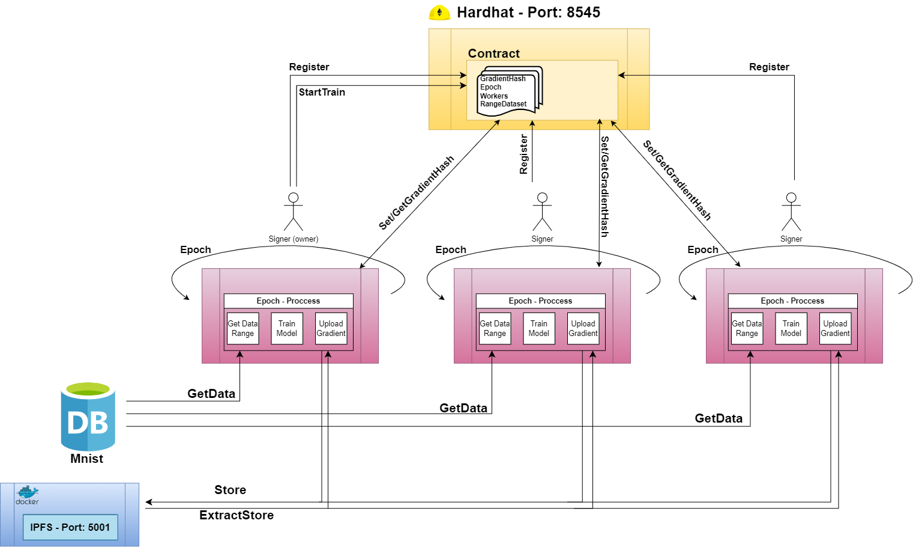

# Machine Learning on Blockchain

Created by Daniel Marko

## Introduction
The aim of this project is to demonstrate the advantages of machine learning models by utilizing blockchain technology.
We will be working within:
   *   the Hardhat environment
   *   IPFS
   *   Web3.



## Instructions

1. **Run the Hardhat Node**  
   Start by launching the Hardhat node in your terminal:
   ```bash
   npx hardhat node
   ```
2. make deploy a contract and confing the Hardhat:
   ```bash
   npx hardhat run scripts/deploy.js --network localhost   
   ```

3. get the Address and ABI of the contract:
   save them in the *config.py*

4. Run in docker IPFS:
   ```bash
   docker run -d --name ipfs-node --restart=always -v ipfs-data:/data/ipfs -p 5001:5001 -p 8080:8080 ipfs/go-ipfs:v0.7.0  
   ```

5. Make DP in server_py: 
   ```bash
   python3 interact.py   
   ```


## Result

This project work on Mnist Dataset, and the Result is: Match 98%